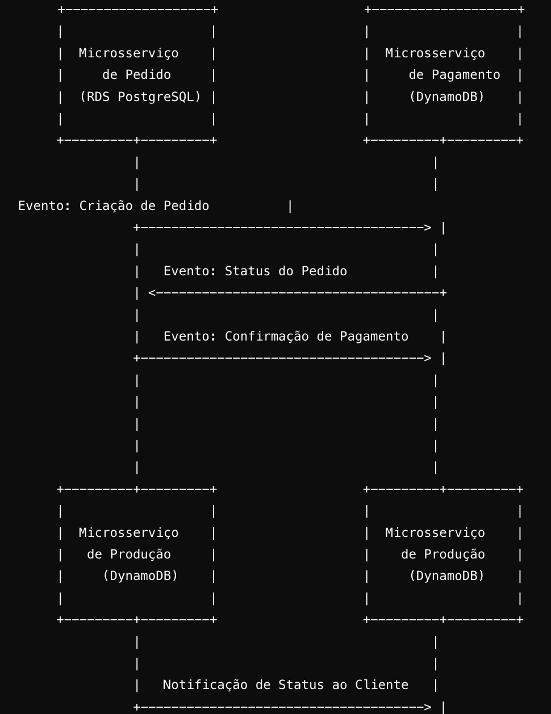

# Tech Challenge FIAP - Green Trace Food Lanches
Projeto Fase 5 da pós graduação da FIAP de Arquitetura de Software

### Grupo 2 - Membros:
* RM352611 - José Ronaldo Leles Júnior - email: juniorleles80@gmail.com
* RM352829 - Saulo Carvalho Gomes - email: sgomesnet@gmail.com
* RM353122 - Fabrício Guimarães de Oliveira - email: fguimaraesoliveira@gmail.co


## Documentação
* [Wiki - Notion](https://grupo2-techchallenge.notion.site/fda6d866c084429fb7257c1ffc9f12d6?v=703211fd8fc34d9d8b0e2b4da5c3415e)
* [Relatório de Impacto à Proteção de Dados Pessoais - RIPD](https://github.com/FabricioGuimaraesOliveira/fiap-techchallange/blob/main/RIPD.pdf)
* [OWASP - Zap Scanning Report](https://github.com/FabricioGuimaraesOliveira/fiap-techchallange/blob/main/2024-09-10-ZAP-Report.html)

# Repositórios relacionados
* [Serviço de produto](https://github.com/FabricioGuimaraesOliveira/fiap-producao)
* [Serviço de pedidos](https://github.com/FabricioGuimaraesOliveira/fiap-techchallange)
* [Serviço de pagamento](https://github.com/FabricioGuimaraesOliveira/fiap-pagamento)
* [Infraestrutura Terraform](https://github.com/FabricioGuimaraesOliveira/fiap-terraform)
* [Lambda de Autenticação](https://github.com/FabricioGuimaraesOliveira/fiap-authentication-lambda)

# Repositórios relacionados
* [Serviço de produto](https://github.com/FabricioGuimaraesOliveira/fiap-producao)
* [Serviço de pedidos](https://github.com/FabricioGuimaraesOliveira/fiap-techchallange)
* [Serviço de pagamento](https://github.com/FabricioGuimaraesOliveira/fiap-pagamento)
* [Infraestrutura Terraform](https://github.com/FabricioGuimaraesOliveira/fiap-terraform)
* [Lambda de Autenticação](https://github.com/FabricioGuimaraesOliveira/fiap-authentication-lambda)

## Dependências
* [IntelliJ IDEA (Opcional)](https://www.jetbrains.com/idea/download/#section=windows)
* [Java JDK 21](https://www.oracle.com/java/technologies/javase/jdk21-archive-downloads.html)
* [Spring Boot 3.1.0](https://spring.io/projects/spring-boot)
* [PostgreSql](https://www.postgresql.org/download/)
* [Maven](https://maven.apache.org/)
* [Docker](https://www.docker.com/)


## Executando aplicação completa via docker

Execute o comando abaixo para iniciar os containers com a base de dados e executar a aplicação localmente.

```bash
docker-compose up -d
```

## Endpoints
Para visualizar os endpoints disponíveis na aplicação basta acessar o swagger em [http://localhost:8080/swagger-ui/index.html](http://localhost:8080/swagger-ui/index.html)

## Padrão Saga com Coreografia
No projeto Green Trace Food Lanches, optamos por implementar o padrão Saga utilizando Coreografia para orquestrar as transações distribuídas entre os microsserviços de Pedido, Pagamento e Produção. 
Esse padrão é especialmente útil em cenários onde os serviços precisam operar de forma autônoma e interagir via eventos assíncronos, sem uma orquestração centralizada.

Por que utilizamos o padrão Saga com Coreografia?
* Autonomia dos Microsserviços: Com a coreografia, cada microsserviço é responsável por reagir a eventos específicos e realizar suas operações de maneira independente. Não há necessidade de um orquestrador central para gerenciar o fluxo da transação. Isso torna os serviços mais resilientes e independentes.

* Desacoplamento Total: Utilizando eventos e o AWS SQS como mecanismo de comunicação, cada serviço fica desacoplado dos demais, o que facilita a manutenção e a evolução do sistema. Um serviço pode ser modificado ou escalado sem impactar diretamente os outros.

* Escalabilidade e Performance: Com a coreografia, os microsserviços podem escalar de forma independente, processando os eventos conforme a demanda. Isso é particularmente útil quando o volume de transações aumenta, já que os serviços reagem aos eventos de forma assíncrona.

* Resiliência e Tolerância a Falhas: A coreografia facilita a recuperação em caso de falhas. Se um serviço falha, ele pode ser reprocessado ou compensado através de eventos de falha, sem interromper o fluxo geral. Além disso, o padrão Saga garante que qualquer ação que precise ser desfeita (em caso de falhas em algum serviço) possa ser compensada por outros microsserviços, mantendo a consistência do sistema.

* Redução de Complexidade: Diferentemente da orquestração, a coreografia elimina a necessidade de um componente central que gerencie todo o fluxo de transações. Isso simplifica a arquitetura e evita pontos únicos de falha, permitindo que cada serviço tenha controle sobre sua parte da transação.

## Como a Coreografia Funciona no Projeto?
No fluxo de transações entre Pedido, Pagamento e Produção, a comunicação ocorre da seguinte forma:

* Pedido cria um novo pedido e envia um evento via AWS SQS.
* Pagamento processa o pagamento do pedido criado e envia um evento de confirmação.
* Produção recebe o evento e atualiza o status da produção(Preparando, Pronto, Entregue) do pedido pela cozinha.
* Producao envia um evento notificando cada status do pedido ao cliente

## Fluxo de Eventos

